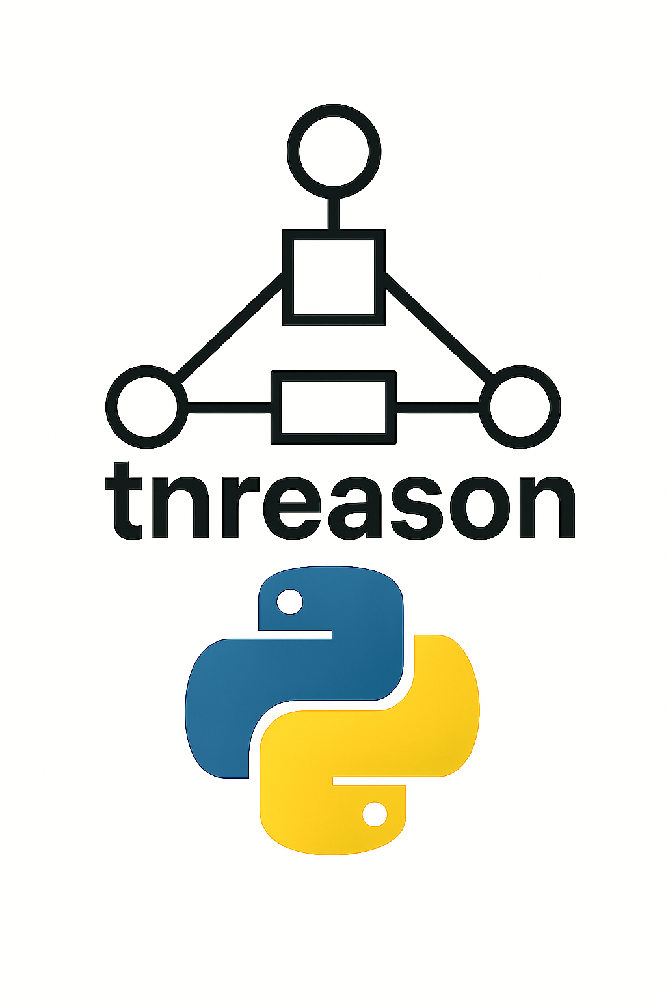

# The Tensor Network Approach to Efficient and Explainable AI

This repository stores research notes on a unifying numerical approach to logical and probabilistic reasoning, as well as data storage. 

## tnreason:  Accompanying Implementation

For prototyping purposes, the implementation of the ideas has been published as the `tnreason` python package, which is maintained at
the [tnreason repository](https://github.com/EnexaProject/enexa-tensor-reasoning).

  

